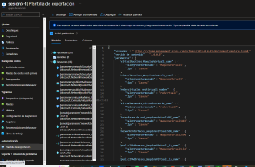
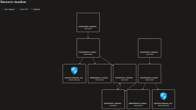
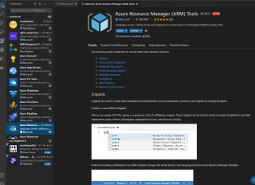
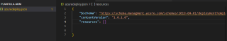
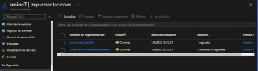
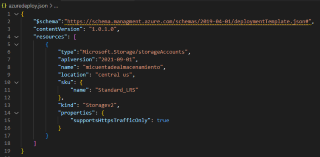
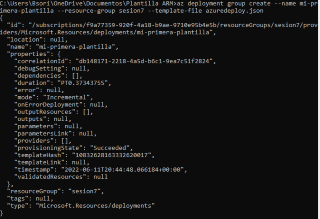

## Plantillas ARM

**ARM = Azure Resource Managment**

- Este crea las plantillas 

- Existen plantillas que son documento que nosotros podemos cargar a azure y descargar para hacer implementaciones o automatizacion.

-------------------------------------------------------------------------------------------------------------------------------------------------
### Pasos para crear una plantilla ARM.

1.- Nos vamos a a un recurso y nos vamos hasta abajo en donde dice exportar plantilla.

2.- Nos va a generar todo lo que hizo azure para generar esta plantilla.

3.- Nos vamos a donde dice **Visualizar Plantilla** y esto nos va generar una vista donde veremos todas las dependencias, que nos puede servir para documentar de una formas mas pro.

## Estas son las plantillas ARM

Pero nosotros Podemos hacer nuestras plantillas

1.- Debemos abrir Visual Code.

2.- Y crearemos un archivo llamado **azuredeploy.json**.

3.- Ahora instalamos una extension llamada **Azure Resource Manager (ARM)**.

4.- Para hacer una plantilla Basica de ARM.

5.- Escribiremos el siguiente codigo: 

{

    "$schema": "https://schema.managment.azure.com/schemas/2019-04-01/deploymentTemplate.json#",
    "contentVersion": "1.0.1.0",
    "resources": []
    
}

6.- Despues nos vamos al CMD y escribimos el comando **az** **deployment** **group** **create** **--name** **mi-primera-plantilla** **--resource-group** **sesion7** **--template-file** **azuredeploy.json**.

7.- No vamos a nuestro recurso y no vamos a la parte **Implementaciones**, aca podemos ver la implementacion que se acaba de hacer.

8.- Aca podriamos implementar un **Storage Accaount**.

9.- Este seria el comando 

        {
            "type":"Microsoft.Storage/storageAccounts",
            "apiversion":"2021-09-01",
            "name": "micuentadealmacenamiento",
            "location": "central us",
            "sku": {
                "name":** **"Standard_LRS"
            },
            "kind":** **"Storagev2",
            "properties": {
                "supportsHttpsTrafficOnly": true
        }
        
        
        
        

10.- Nos vamos al CMD y volvemos a poner el comando anterior **az** **deployment** **group** **create** **--name** **mi-primera-plantilla** **--resource-group** **sesion7** **--template-file** **azuredeploy.json**.

11.- Y se creara el recurso

12.- Listo esta es una plantilla
